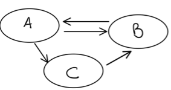
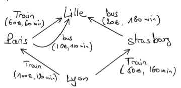

<!-- _class: lead -->
<!-- _header: "" -->
<!-- _footer: "" -->
<!-- _paginate: false -->

<style scoped>
  section.lead {background: white;}
</style>

# Python
### Programmation Orientée Objet 


---

<!-- _class: lead -->
<!-- _paginate: false -->

## Python - Programmation Orientée Objet

---

## Les classes et instances

<style scoped>.txt {font-size: 23px;}</style>

<div class="columns">

<div class="txt">

- Une **classe** est le "**moule**" servant à la fabrication des **objets/instances** du **type correspondant à cette classe**
- On peut voir la classe comme le **récapitulatif** des **éléments** que vont posséder tous les **objets** de ce type. Par exemple un Chien a un âge, un nom, une race ect...
- Tous ces éléments se retrouveront dans la classe et seront (ou non) définis à **l'instanciation** d'un objet de ce type.
- En python, on définit une class avec le bloc **class**. Tous les blocs **def** à l'intérieur créeront des **méthodes relatives à la classe** et non des fonctions.

</div>

<div class="code">

```python
class Chien:
  """ Représentation d'un chien """

  def __init__(self,nom,age,race):
    self.nom = nom
    self.age = age
    self.race = race

  def aboyer(self):
    print(f"Wouf Wouf {self.nom}")
```

</div>


</div>

---

## Le constructeur \_\_init__

<style scoped>div {font-size: 25px;}</style>

<div>

<div class="txt">

Le **constructeur** est le point d'entrée pour la création d'une **instances/objet** du **type de la classe (instanciation)**. Il s'agit d'une **méthodes** dite **Dunder** ou **Magique** (dont le nom commence et fini par deux caractères **underscore**). 

</div>

<div class="code">

```python
class Chien:
  def __init__(self,nom,age,race):
    self.nom = nom
    self.age = age
    self.race = race
```
</div>

<div class="txt">

Le constructeur est appelé lorsque l'on souhaite instancier une classe, on écrit le **nom de la classe** et non \_\_init__.

</div>

<div class="code">

```python
chien_1 = Chien("REX", 12, "Berger Allemand")
```
</div>

<div class="txt">

Une fois la **variable** renvoyant vers **l'instance** de Chien créée, on peut la manipuler et utiliser ses méthodes.

</div>

<div class="code">

```python
chien_1.aboyer() # Wouf Wouf REX
```
</div>

---

## Les paramètres de méthodes 'self'

<style scoped>.txt {font-size: 28px;}</style>

<div>

<div class="txt">

- Pour référencer **l'objet instancié** lors de la déclaration des méthodes d'une classe, on utilise un **paramètre supplémentaire** en **premier**.
- La norme est de le nommer **self**
- Lors de l'appel de ces méthodes, **on ne devra pas renseigner cet argument**.

</div>

<div class="columns">

<div>

```python
  def __init__(self,nom,age,race):
    self.nom = nom
    self.age = age
    self.race = race

  def aboyer(self):
    print(f"Wouf Wouf {self.nom}")
```
</div>

<div>

```python
chien_1 = Chien("REX", 12, "Berger Allemand")
chien_1.aboyer() # Wouf Wouf REX
```
</div>

</div>


</div>

---

## Les attributs

<style scoped>div {font-size: 25px;}</style>

<div>

<div class="txt">

Un **attribut** de classe est une **variable** qui est associée à cette classe.
Il est en général **définit** et **affecté** dans le **constructeur**.
Il peut être **accédé** et **réaffecté** via la notation **variable_objet_attribut** 

</div>

<div class="code">

```python
chien_1.age = 6
print(f"Le chien s'appelle {chien_1.nom}, il a {chien_1.age} ans")
print(f"{chien_1} est donc né en {date.today().year-chien_1.age}")
```
</div>

<div class="txt">

Un **objet** est une valeur référence, c'est-à-dire qu'il est **mutable** et qu'on peut ainsi **le passer en paramètre de fonction ou de méthode** et voir **s'opérer des changements** en cas de modifications éventuelles de ses attributs.

</div>

<div class="code">

```python
def change_nom(chien, nouveau_nom):
  chien.nom = nouveau_nom

chien_1.nom = "REX"
print(chien_1.nom) # REX
change_nom(chien_1, "Bill")
print(Chien_1.nom) # Bill
```
</div>

---

## Les attributs implicites <span style="background-color: red; color: white; padding: 5px;margin-left: 415px; font-size: 35px">Avancé</span>

<style scoped>.txt {font-size: 22px;}</style>

<div class="columns">

<div class="txt">

Ces attributs sont créés **par défaut** lors de la manipulation des classes.
Ils utilisent via la syntaxe **Dunder** (double underscore)

Pour la classe on a:
  - **\_\_name__**: le nom de la classe
  - **\_\_doc__**: commentaire associé à la classe
  - **\_\_dict__**: le dictionnaire des attributs statiques
  - **\_\_bases__**: un tuple des classes dont celle-ci hérite
  - **\_\_module__**: contient le nom du module dans lequel la classe a été définie

Pour l'instance on a:
  - **\_\_class__**: la classe de l'objet.
  - **\_\_dict__**: la liste des attributs d'instance

</div>

<div class="code">

```python
class MaClasse:
  """ une classe """
  test = 0
  def __init__(self):
    self.test1 = 1

cl = MaClasse()

# Classe
print(MaClasse.__name__) # MaClasse
print(MaClasse.__doc__) # une classe
print(MaClasse.__dict__) # {"test": 0, ...}
print(MaClasse.__bases__) # (<class 'object'>,)
print(MaClasse.__module__) # __main__

# Instance
print(cl.__class__) # <class '__main__.MaClasse'>
print(cl.__class__.__name__) # MaClasse
print(cl.__dict__) # {'test1': 1}
print(cl.__doc__) # une classe
```

</div>


</div>

---

## Les méthodes

<style scoped>div {font-size: 25px;}</style>

<div>

<div class="txt">

Une **méthode** est l'équivalent d'une **fonction** qui est **associée** à un **objet** ou à une **classe**.
Pour faire **appel** à une méthode, il faudra utiliser la notation **Classe.méthode()** ou **objet.méthode()**.
Une méthode peut accéder aux **attributs** de **l'objet auquel elle est associée** en passant encore une fois par le **paramètre self**, qu'elle doit avoir en tant que **premier paramètre**:

</div>

<div class="code">

```python
def aboyer(self):
  print(f"Wouf Wouf {self.nom}")
```
</div>

<div class="txt">

Une méthode peut réaliser tout ce qu'une fonction faisait de base, mais est en général utilisée pour **éviter d'avoir à passer en argument** des **valeurs** qui sont **déjà dans les attributs de l'objet**:

</div>

<div class="code">

```python
def afficher(self):
  print(f"Mon chien a {self.age} ans, il s'appelle {self.nom} de la race {self.race}")
```
</div>

<div class="txt">

Une méthode participe ainsi activement à la réalisation d'un code plus propre et à la mise en place du **DRY (Don't repeat yourself)** dans le cadre d'un programme.

</div>

---

## Exercice

<style scoped>div {font-size: 28px;}</style>

<div> 

1. Créer un classe **Gateau**
2. Ajouter les attributs suivants et les initialiser dans le constructeur :
   1. **nom gâteau**:str
   2. **temps cuisson**:int
   3. **liste ingrédients**:list de str
   4. **étapes recettes**: list de str
   5. **nom du créateur**: str
3. Ajouter une méthode qui affiche les ingrédients de la recette
4. Instancier un objet gâteau qui affiche les ingrédients ainsi que les étapes de préparation du gâteau.
  
</div>

---

## Exercice

<style scoped>div {font-size: 27px;}</style>

<div> 

1. Créer un classe **CompteBancaire** qui représente un compte bancaire, ayant pour attributs :
   1. **numeroCompte**:int
   2. **nom**:str
   3. **solde**:int
2. Créer un constructeur ayant comme paramètres: numero_compte, nom, solde.
3. Créer une méthode Versement() ui gère les versements
4. Créer une méthode Retrait() qui gère les retraits
5. Créer une méthode Agios() permettant d'appliquer les agios à un pourcentage de 5% du solde.
6. Créer une méthode afficher() permettant d'afficher les détails sur le compte.
  
</div>

---

## Les propriétés <span style="background-color: red; color: white; padding: 5px;margin-left: 635px; font-size: 35px">Avancé</span>

<style scoped>.txt {font-size: 22px;} .code{font-size: 26px;}</style>

<div class="columns">

<div class="txt">

- Les propriétés sont **trois méthodes magiques** qui sont appelées en cas de **récupération (getattr)**, **d'affectation (setattr)** ou de **suppression (delattr)** d'un attribut.
- Il est ainsi possible de **surcharger/override** ces méthodes magiques pour **en modifier le fonctionnement**.
- Cela évite ainsi d'avoir à répéter des lignes de codes et également la création de méthodes destinées à contrôler et à modifier les affectations ou les récupérations d'attributs d'objets (nommé getters et setters). 

<div class="code">

```python
ma_temperature = Temperature(37.5)
ma_temperature.celcius = 25
print(ma_temperature.fahrenheit) # 99.5
```

</div>

</div>

<div class="code">

```python
class Temperature:
  def __init__(self, value):
    self.value = value

  def __getattr__(self,name):
    if name == 'celsius':
      return self.value
    if name == 'fahrenheit':
      return self.value * 1.8 + 32
    raise AttributeError(name)

  def __setattr__(self, name, value):
    if name == 'celcius':
      self.value = value
    if name == 'fahrenheit':
      self.value = (value - 32) / 1.8
    else :
      super().__setattr__(name, value)
```

</div>


</div>

---

## Les propriétés <span style="background-color: red; color: white; padding: 5px;margin-left: 635px; font-size: 35px">Avancé</span>

<style scoped>.txt {font-size: 25px;}</style>

<div class="columns">

<div class="txt">

- Python fournit également un décorateur **@property**. il permet d'appeler une **méthode** comme si on tentait **d'accéder** à un **attribut de l'objet** portant le **même nom**.
- Le décorateur **@<prop>.setter** permet d'appeler la méthode **méthode** comme si on tentait **de définir l'attribut de l'objet** portant le **même nom**.

</div>

<div class="code">

```python
@property
def nom(self):
  return self._nom

@nom.setter
def nom(self, nom):
  self._nom = nom

objet.nom = "le nom"
print(objet.nom)
```

</div>


</div>
<div class="code">

```python
@property
def age(self):
  today = date.today()
  age = today.year - self.birth_date.year - ((today.month, today.day) < (self.birth_date.month, self.birth_date.day))
  return age
```

</div>

---

## Les attributs de classe

<style scoped>.txt {font-size: 22px;}</style>

<div class="columns">

<div class="txt">

- En plus des **attributs** liés à **un objet/instance**, il est possible de faire appel à ce qu'on appelle des **attributs de classe**.
Ils sont **partagés** par l'ensemble **des objets de ce type**, ils sont **liés à la classe elle-même**
- On peut par exemple se servir des attributs de classe pour compter facilement les objets instanciés de cette classe ou pour acceder à des valeurs communes à tous les éléments de ce type.
- Pour accéder à un attribut de classe, on doit se servir de la syntaxe **Classe.attribut**.   

</div>

<div class="code">

```python
class Chien:
  instances_chien = 0
  nom_latin = "Canis lupus familiaris"

  def __init__(self, age, nom, race):
    Chien.instances_chien += 1
    self.age = age
    self.nom = nom
    self.race = race
```

</div>


</div>
<div class="code">

```python
print(f"Il y a {Chien.instance_chien} instances de chiens dont le nom latin est :{Chien.nom_latin}")
# Il y a 2 instances de chiens dont le nom latin est : Canis lupus familiaris
```

</div>

---

## Les méthodes de classe

<style scoped>.txt {font-size: 25px;}</style>

<div class="txt">

- Une **méthode de classe** est **une méthode** qui est **liée à la classe** et non à **l'objet**.
- Pour en définir une on utilise le décorateur **@classmethod**
- Elle a accès **à l'état de la classe** par le biais d'un paramètre que l'on nomme **cls** par convention, il est en **premier** (à la place de self) et **pointe vers la classe** et non l'objet.
- On accèdera aux attributs de classe avec **cls.attribut**
- Pour faire appel à une méthode de classe on utilise la syntaxe suivante : **Classe.méthode_de_classe**. 

</div>

<div class="code">

```python
@classmethod
def afficher_nombre_chiens(cls):
  print(f"Il y a {cls.nombre_chiens} instanciés")
```

</div>

--- 

## Les méthodes statique

<style scoped>.txt {font-size: 25px;}</style>

<div class="txt">

- Une **méthode statique** ne reçoit pas de premier argument implicite (self, cls).
- Une méthode statique est également une méthode qui est **liée à la classe** et non à l'objet.
- Cette méthode ne peut pas accéder ou modifier l'état de la classe.
- Elle est destinées à avoir un comportement qui ne change pas, elle est comme une fonction classique en soit.

Pour faire une méthode statique, il faut donc utiliser le décorateur **@staticmethod** et on l'appellera dans le coeur de notre programme (comme pour les méthodes de classe) la syntaxe **Classe.méthode()**: 

</div>

<div class="code">

```python
@staticmethod
def seuil_chien(max):
  print(f"Il y a {max - Chien.nombre_chiens} disponibles dans le refuge")

Chien.seuil_chien(10) # Il y a 8 places disponibles dans le refuge
```

</div>

--- 

## Exercice

<style scoped>div {font-size: 27px;}</style>

<div> 

1. Créer un classe **WaterTank** qui possédera **les attributs d'instance** suivants :
   1. **Poids** de la citerne à **vide**: float
   2. **Capacité maximale**: float
   3. **Niveau de remplissage**:float
2. Créer les **méthodes** quivantes propre à chaque instance de classe: 
   1. Méthode indiquant le **poids total**
   2. Méthode pour **remplir la citerne** avec un **nombre de litre d'eau**
   3. Méthode pour **vider la citerne** d'eau d'un **nombre de litre d'eau**
3. Créer un **atribut de classe** qui contiendra **la totalité des volumes d'eau** des citernes.  
  
</div>

---

#### Différence entre méthode de classe et méthode statique

<div class="txt">

| Méthode de classe | Méthode statique |
|-------------------|------------------|
|Une méthode de classe prend comme **premier paramètre cls** (la classe) | Une méthode statique n'a **pas d'arguments par défaut**|
| Une méthode de classe peut **accéder et modifier l'état d'une classe via le paramètre cls** | Une méthode statique ne peut pas **accéder ou modifier l'état d'une classe sans utiliser la syntaxe avec le nom de la classe**.|
|La méthode class prend **la classe comme paramètre pour connaître l'état de cette classe (cls)** | Les méthodes statiques **ne connaissent pas l'état de la classe**. Ces méthodes sont utilisées pour effectuer certaines tâches utilitaires en prenant certains paramètres, comme des fonctions. |
| Utilisation du décorateur **@classmethod** | Utilisation du décorateur **@staticmethod**|

</div>

--- 

## L'héritage

<style scoped>.txt {font-size: 22px;}</style>

<div class="columns">

<div class="txt">

- **L'héritage** est un mécanisme fortement utilisé dans la programmation orienté objet.
- Une classe peut **hériter** d'une **autre classe** et possédera **les méthodes** et **les attributs** de celle-ci.
- On parle alors de **classe fille/enfant** et de **calsse mère/parent**.
- Pour **réaliser un héritage** en Python il suffit **d'ajouter des parenthèses** après le nom de la classe que l'on créé et d'y **ajouter la classe dont l'on souhaite hériter**.
- Par exemple ici **Chien va hériter de Mammifère** et ainsi avoir accès à ses méthodes et attributs. Cela est correct sémantiquement car on peut dire qu'**un Chien est un Mammifère**.

</div>

<div class="code">

```python
class Mammifere:
  nom_latin = "Mamma"
  nombre_mammifere = 0

  def __init__(self):
    Mammifere.nombre_mammifere += 1

class Chien(Mammifere):
  nom_latin = "Canis Lups Familiaris"

  def __init__(self, nom, age, race)
    super().__init__()
    self.nom = nom
    self.age = age
    self.race = race

mon_chien = Chien("Rex", 4, "Berger Allemand")
print(Mammifere.nombre_mammifere) # 1
```

</div>


</div>

---

## L'utilisation de la méthode super()

<style scoped>.txt {font-size: 17px;} .code{font-size: 20px;}</style>

<div class="columns">

<div class="txt">

- Lors d'un **héritage**, il est possible **d'accéder aux attributs et aux méthodes de la class mère**.
- Si l'on souhaite avoir accès à la méthode **calc_age(annee)** de la classe **Mammifère** pour se servir du résultat dans la classe enfant, on doit utiliser le mot-clé **super()** pour **accéder à la classe parent**, puis la syntaxe **super().nom_méthode()** pour en **appeler la méthode**.
- Le mot clé **super()** est également utilisé dans le cadre d'un **constructeur** pour faire appel au **constructeur de la classe parent** qui pourrait avoir besoin de paramètres, comme ci-dessous

<div class="code">

```python
class Personne:
  def __init__(self, nom, prenom, age)
    self.nom = nom
    self.prenom = prenom
    self.age = age

class Enfant(Personne):
  def __init__(self, nom, prenom, age, jouet)
    super.__init__(nom, prenom, age)
    self.jouet = jouet
```

</div>

</div>

<div class="code">

```python
class Mammifere:​
    nom_latin = "Mamma"​
    nombre_mammifere = 0​

    def __init__(self):​
        Mammifere.nombre_mammifere += 1​

    def calculer_age(self, annee) -> int:​
        return date.today().year - annee​

class Chien(Mammifere):​
    nom_latin = "Canis Lupus Familiaris"​

    def __init__(self, nom, age, race):​
        super().__init__()​
        self.nom = nom​
        self.age = age​
        self.race = race​

    def age_chien(self) -> int:​
        return super().calculer_age(self.age)
```

</div>


</div>

---

## Exercice

<style scoped>div {font-size: 27px;}</style>

<div> 

1. Écrire une classe **Rectangle** en langage Python, permettant de construire un rectangle doté **d'attributs longueur et largeur**.​

2. Créer une méthode **perimetre()** permettant de calculer le périmètre du rectangle et une méthode **surface()** permettant de calculer la surface du rectangle​

3. Créer une classe fille **Parallélépipède héritant de la classe Rectangle** et dotée en plus d'un** attribut hauteur** et d'une autre méthode **volume()** permettant de calculer le volume du Parallélépipède.​

4. Surcharger les méthodes **périmètre()** et **surface()** du **Parallélépipède** pour avoir les bon résultats pour un parallélépipède (longueurs des arrêtes et surfaces des faces).​

/!\ Sémantiquement ce modèle n’est pas correct car un parallélépipède N’EST PAS un rectangle donc l’héritage n’a pas de sens. 
  
</div>

---

## La classe object

<style scoped>.txt {font-size: 22px;} .code{font-size : 20px}</style>

<div class="txt">

Chaque classe du Python va **automatiquement hériter** d’une classe qui se nomme « **object** ». Cette classe comporte **une série de méthodes et d’attributs** qui seront ainsi automatiquement hérités par les classes enfants. ​

L’exemple le plus courant est sans doute celui de l’héritage de la méthode magique **\_\_repr__** qui est la méthode utilisée lorsque l’on souhaite récupérer la **représentation de l’objet**. Il y a aussi la méthode **\_\_str__** qui sera appelée lors d’un **cast en str**.​

Ou encore l’utilisation des méthodes magiques **\_\_getattr__** et/ou **\_\_setattr__** qui sont les deux méthodes utilisées par les objets pour setter ou getter les attributs qui les constituent (on peut les surcharger dans le but de réaliser des propriétés comme nous l’avons vu précédemment).

</div>

<div class="code">

```python
class Personne:​
    def __init__(self, nom, prenom, age):​
        self.nom = nom​
        self.prenom = prenom​
        self.age = age​

    def __repr__(self):​
        return f"La personne s'appelle {self.prenom} {self.nom} et a {self.age} ans"​

personne_1 = Personne("Dupont", "Jean", 40)​
print(personne_1) # La personne s'appelle Jean Dupont et a 40 ans
```

</div>

--- 

## Le polymorphisme

<style scoped>.txt {font-size: 19px;}</style>

<div class="columns">

<div class="txt">

- Le **polymorphisme** est une autre notion clé de la programmation orienté objet.​

- Le polymorphisme consiste en l’utilisation d’une **version différente d’une méthode**, on appelle ça aussi **surcharger/override** une méthode. ​

- On peut réutiliser la méthode du parent avec **super().nom_méthode().​**

- On voit ici que lors du parcours de la liste on appellera **les méthodes jouer()** des classes que l’on est en train de parcourir.​La méthode jouer de la classe Enfant va **remplacer** celle de la classe Personne

<div class="code">

```python
liste_personnes = [​
    Personne("Jean", "Dupont", 30), ​
    Enfant("Titou", "Enfant", 5, "Légo")​
]​
for personne in liste_personnes:​
    personne.jouer()
```

</div>

</div>

<div class="code">

```python
class Personne:​
    def __init__(self, nom, prenom, age):​
        self.nom = nom​
        self.prenom = prenom​
        self.age = age​

    def jouer(self):​
        print("L'adulte n'a plus le temps de jouer")​
​
class Enfant(Personne):​
    def __init__(self, nom, prenom, age, jouet):​
        super().__init__(nom, prenom, age)​
        self.jouet = jouet​

    def jouer(self):​
        print(f"L'enfant joue avec {self.jouet}")
```

</div>


</div>

---

## Duck typing

<style scoped>.txt {font-size: 22px;} .code {font-size: 28px}</style>

<div class="columns">

<div class="txt">

- Le Duck Typing est un concept de Python provenant de l’expression anglophone «** If it walks like a duck, and it quacks like a duck, then it must be a duck** » (ou en français : Si ça marche comme un canard, que cela cancane comme un canard, alors cela doit être un canard).​

- Selon cette expression, il est **inutile de tester les types des classes** avant **d’appeler des méthodes qui leur sont accessibles**. Par exemple, il est possible d’utiliser la méthode **len()** donnant la taille de l’objet sur plusieurs types de variables, qu’elles soient ou non des conteneurs.

</div>

<div class="code">

```python
class CoinCoin:​
    def __len__(self):​
        return 42​

ma_liste = [1, 4, 23]​
mon_dic = {"nom":"toto", ​
    "prenom":"titi", ​
    "age": 12}​
ma_chaine = "Hello World !"​
mon_canard = CoinCoin()​

print(len(ma_liste)) # 3​
print(len(mon_dic)) # 3​
print(len(ma_chaine)) # 13​
print(len(mon_canard)) # 42
```

</div>

</div>

---

## Visibilité en python : Name Mangling <span style="background-color: red; color: white; padding: 5px;margin-left: 50px; font-size: 35px">Avancé</span>

<style scoped>.txt {font-size: 22px;}</style>

<div class="txt">

En Python, tout comme dans beaucoup de langages servant à réaliser de l’Orienté Objet, on a recours à ce qui s’appelle la **visibilité des attributs et des méthodes** dans le but de **sécuriser nos classes**. Malheureusement pour nous, il n’existe pas de mot-clés **private, protected, public**, etc… comme dans d’autres langages de programmation tels que le Java ou le C#. ​

A côté de cela, il existe en Python une **convention de nommage** permettant facilement aux développeurs Python de repérer si une variable ou une méthode est de type **publique, privée ou protégée**. Cette convention se base sur le « **name mangling** », une autre propriété du Python qui fait que lorsque l’on essaie d’accéder à une variable par la notation «**objet.__attribut**», l’interpréteur va en réalité transformer la chose en « **_nom-classe__nom-attribut** ». Ce processus est prévu dans le but de sécuriser les accès aux attributs de type privés, qui peuvent cependant encore être accédés via la syntaxe « **objet._nom-classe__nom-attribut** »​

Ainsi, on a donc recours à ces conventions de nommage :​
- Les attributs et méthodes publiques sont nommés « **ainsi** »​
- Les attributs et méthodes protégés sont nommés « **_ainsi** »​
- Les attributs et méthodes privés sont nommés « **__ainsi** »

</div>

---

## Exercice

<style scoped>div {font-size: 27px;}</style>

<div> 

1. Créer une classe **Personne**, contenant le nom de la personne, son **prénom**, son **numéro de téléphone** et son **email**. Une méthode **\_\_str__** pour afficher les données de la personne.​

2. Créer une classe **Travailleur** , qui hérite de la classe Personne et étend avec les attributs **nom d’entreprise, adresse entreprise et téléphone professionnel**. Une méthode **\_\_str__** pour afficher les données et qui **réutilise celle de Personne**.​

3. Créer une classe **Scientifique** qui hérite de la classe Travailleur et étend avec les attributs de type list **disciplines** (physique, chimie, mathématique, …) et **types du scientifique** (théorique, expérimental, informatique...) Une méthode \_\_str__ pour afficher les données et **qui réutilise celle de Travailleur**.
  
</div>

---

## Le polymorphisme

<style scoped>.txt {font-size: 16px;} .code {font-size: 21px}</style>

<div class="columns">

<div class="txt">

En Python, il est possible pour **une classe d’hériter de plusieurs classes**, ce qui peut conduire à des **situations délicates** que l’interpréteur solutionne en usant de ce que l’on appelle le « **MRO** » (Method Resolution Order). Il s’agit d’une liste contenant **l’ordre d’apparition des classes** servant pour l’héritage d’une classe. Pour accéder à cette MRO, il est possible d’avoir recours à la méthode **.mro()**, tout simplement.​
\
Lors d’un **héritage multiple**, il est possible d’avoir comme situation un héritage dit « **en diamant** »,​ car une classe est héritée par **deux classes** qui seront à leur tour héritées par une **même​ classe**. Dans ce genre d’héritage, il faudra bien faire attention à se servir du constructeur de la​ super-classe via l’utilisation du mot-clé **super()**, qui va en réalité chercher dans la MRO le ​constructeur dont on a besoin pour éviter les conflits. De plus, en cas de polymorphisme, ​c’est via la MRO que l’on saura laquelle des deux méthodes redéfinies sera utilisée.

<div class="code">

```python
class Toutou(Animal, Carnivore):​
    """Un chien qui est à la fois un animal et un carnivore"""​

toutou = Toutou()​
toutou.se_nourrir()​
print(toutou.point_de_vie)
```

</div>

</div>

<div class="code">

```python
class EtreVivant:​
    def __init__(self):​
        self.point_de_vie = 100​

    def se_nourrir(self):​
        self.point_de_vie += 1​

class Animal(EtreVivant):​
    def dormir(self):​
        self.point_de_vie += 1​

    def se_nourrir(self):​
        self.point_de_vie += 5​

class Carnivore(EtreVivant):​
    def chasser(self):​
        self.point_de_vie -= 1​

    def se_nourrir(self):​
        self.point_de_vie += 10
```

</div>


</div>

---

## Exercice

<style scoped>div {font-size: 19px;}</style>

<div class="columns">

  <div>

  ```python
class Address:​
    def __init__(self, street, city):​
        self.street = str(street)​
        self.city = str(city)​

    def show(self):​
        print(self.street)​
        print(self.city)
  ```

  </div>

  <div>

```python
class Person:​
    def __init__(self, name, email):​
        self.name = name​
        self.email= email​

    def show(self):​
        print(self.name + ' - ' + self.email)
```

  </div>

</div>

<div> 

1. Créer la classe **Contact** qui **hérite à la fois** de **Address** et **Person**, cette classe doit implémenter la méthode **show()​**

2. Créer une classe **Notebook** qui contient un **dictionnaire** qui associe **les noms des personnes** à un **objet Contact**. (Pas besoin d’héritage)​
     - Cette classe devra avoir une méthode **show()**​
     - Cette classe doit avoir une méthode **add(self, name, email, street, city)​**

3. Tester le code suivant : 


<div class="columns">

  <div>

  ```python
  notes = Notebook()​
  notes.add('Alice', '<alice@example.com>', 'Lv 24', 'Sthlm')​
  notes.show()
  ```

  </div>

  <div>

  ```
  === Alice ===
  Alice - <alice@exemple.fr>
  lv 24
  sthlm
  ```

  </div>

</div>
  
</div>

---

## Tp - sur deux slides

<style scoped>div {font-size: 16px;}</style>

<div> 

- Dans cet exercice on s’intéresse à créer **des classes pour gérer les vols d’une compagnie aérienne** qui organise des vols **entre des villes**. ​

- Plus précisément on s’intéressera aux plans de vol entre les différentes villes. ​

- Càd les vols disponibles ainsi que l’heure de départ.​

- Créer une classe **Vol_direct** qui représentera un vol direct entre deux villes (pas d’escale dans une ville intermédiaire), on doit :​

  - Définir le constructeur de cette classe qui a quatre attributs : ​

    - Dep et arr qui désigne respectivement la ville de départ et la ville d’arrivée ​

    - jour qui désigne le jour de la semaine (lundi, mardi, ...)​

    - **heure (un entier entre 0 et 24** qui représente l’heure de départ )​

  - Écrire une méthode **affiche()** qui affiche une chaîne bien formatée de la forme :​
    « **Ce vol part de Paris vers Marseille le lundi à 9 heure** »​

- Créer une classe **Vols** qui représente tous les vols le long de la semaine en utilisant la classe Vol_direct. Pour ce faire on doit :​

  - Définir le **constructeur** de cette classe avec  **un seul attribut qui est une liste de vols​**

  - Écrire une méthode **Liste_successeurs** qui retourne une **liste** contenant **les villes arrivées d’une ville de départ passée comme paramètre​**

  - Écrire une méthode **Appartient** qui vérifie **si une ville appartient au plan du vol** que ce soit comme ville d’arrivée ou de départ ​

  - Écrire une méthode **Affiche** qui affiche tous les vols directs.
  
</div>

---

## Tp - suite

<style scoped>div {font-size: 19px;}</style>

<div> 

Écrire un **programme principal** permettant de :​

- Créer une **liste** nommée **lv** d’objets Vol_direct, on suppose avoir définie les 3 fonctions suivantes : ​

  - **Saisie_Jour** qui retourne un jour valide,  ​

  - **Saisie_Heure** qui retourne une heure valide​

  - **Saisie _Ville** qui retourne un nom de ville valide.​

- Créer un **objet Vol** nommé **v** à partir de la liste déjà créée​

- Afficher tous les vols​

- Saisir une ville qui doit appartenir au plan du vol puis calculer et afficher la liste de ses successeurs

  ```
  === Liste des vols ===
  Ce vol part de Paris vers Marseille le 17 à 4 heures
  Ce vol part de Paris vers Lyon le 21 à 8 heures
  Ce vol part de Marseille vers Lyon le 11 à 17 heures
  Ce vol part de Paris vers Bruxelles le 4 à 20 heures

  La ville Paris fait partie du plan de vol !
  La ville Bruxelles fait partie du plan de vol !
  La ville Bordeaux ne fait pas partie du plan de vol

  La liste des destinations à partir de Paris est : {'Lyon', 'Marseille', 'Bruxelles'}
  ```
  
</div>

---

## Méta-classe <span style="background-color: red; color: white; padding: 5px;margin-left: 635px; font-size: 35px">Avancé</span>

<style scoped>.txt {font-size: 22px;} .code{font-size: 26px;}</style>

<div class="columns">

<div class="txt">

La méta-classe est un concept avancé en Python qui n’est que très rarement utilisé directement par les développeurs.​
En Python, les classes sont elles-mêmes des objets qui **héritent de type**. Il est possible de spécifier le type dont doit hériter l’objet qui représente la classe. On parle alors de **méta-classe**. Une méta-classe est une classe qui décrit une classe. Cela signifie que tous les attributs et toutes les méthodes d’une méta-classe seront les attributs et les méthodes de la classe.​
\
L’usage de la méta-classe permet de réaliser des implémentations qui ne sont pas possibles avec une simple classe. Par exemple, décorateur **@property** pour créer une propriété.

</div>

<div class="code">

```python
class MetaClasseCompteur(type):​
    """Une méta classe pour aider à compter les instances créées."""​
​
    def __init__(cls, *args, **kwargs):​
        super().__init__(*args, **kwargs)​
        cls._nb_instances = 0​
​
    @property​
    def nb_instances(cls):​
        return cls._nb_instances​
​
    def plus_une_instance(cls):​
        cls._nb_instances += 1​
​
class MaClasse(metaclass=MetaClasseCompteur):​
​
    def __init__(self):​
        MaClasse.plus_une_instance()​
​
print(MaClasse.nb_instances) # 0​
o1 = MaClasse()​
o2 = MaClasse()​
o3 = MaClasse()​
print(MaClasse.nb_instances) # 3
```

</div>

</div>

---

## Duck typing

<style scoped>.txt {font-size: 20px;} .code {font-size: 28px}</style>

<div class="columns">

<div class="txt">

En Python, le module **abc** permet de simuler le fonctionnement d’une **classe abstraite** (qui **ne doit pas être instanciable et est destinée uniquement à l’héritage**). Le nom de ce module est la contraction de « abstract base classes ». ​
\
Ce module fournit une classe **ABC** et une méta-classe appelée **ABCMeta** qui permettent de **transformer une classe Python en classe abstraite**. ​
\
Ce module fournit également le décorateur **@abstractmethod** qui permet de déclarer comme abstraite une méthode, une méthode statique, une méthode de classe ou une propriété. Cela signifie qu’il **n’est pas possible de créer une instance** d’une classe qui hérite d’une classe abstraite **tant que toutes les méthodes abstraites ne sont pas implémentées**.

</div>

<div class="code">

```python
from abc import ABCMeta, abstractmethod

class Animal(metaclass=ABCMeta):
  @abstractmethod
  def crier(sef):
    pass

class Chien(Animal):
  def crier(self):
    print("Whouaf whouaf!")

# a = Animal() -> Impossible ! car abstraite
c = Chien()
c.crier()
```

</div>

</div>

---

## Exercice <span style="background-color: red; color: white; padding: 5px;margin-left: 635px; font-size: 35px">Avancé</span>

<style scoped>div {font-size: 28px;}</style> 

<div> 

- Créer une classe **Interface** héritant de **ABC**.​

- La classe interface implémentera la méthode magique \_\_subclasshook__ qui permet de s’assurer que les méthodes dans la séquence \_\_methods__ sont présentes dans la classe.​

- Créer une classe **Container** qui impose l’existence de la méthode \_\_contains__.​

- Créer une classe **Sized** qui hérite l’existence de la méthode \_\_len__.​

- Créer une classe **SizedContainer** qui impose l’existence de la méthode \_\_len__ et \_\_contains__.​

- Créer une classe **Iterable** qui impose l’existence de la méthode \_\_iter__.
  
</div>

---

## Qu'est-ce qu'une exception ?

<style scoped>div {font-size: 23px;}</style>

<div> 

Une **exception** est un **problème** qui apparaît **lors de l’exécution du programme**. On parle d ’exception car c’est un **cas que le programme n’a pas pu gérer**, littéralement une exception en français. ​
\
Les exemples d’exceptions les plus courants sont les **exceptions de format**, les **exceptions de fichier** **introuvable** ou de **connexion impossible** **en base de données**. ​
\
Pour **réaliser un programme fonctionnel**, il faut **prendre en compte les erreurs** que pourraient causer les utilisateurs et faire en sorte qu’**elles soient non bloquantes**. En effet, lorsque l’on teste notre programme, on peut voir les **exceptions** **se lever**, et ainsi prendre conscience du problème. Ce n’est pas le cas pour les utilisateurs lambdas qui voient simplement le programme se stopper ou figer…​
\
Pour éviter cela, on réalise donc **un bloc de récupération des exceptions** dans le but d’afficher des messages personnalisés ou de stocker les problèmes dans un fichier de log qui pourra par la suite être envoyé aux développeurs dans un soucis de maintenance du logiciel.
  
</div>

---

## Attraper une exception

<style scoped>.txt {font-size: 16px;} .code {font-size: 18px}</style>

<div class="columns">

<div class="txt">

Pour attraper une exception, il faut faire appel à un bloc de type **try…except…else…finally**.​
\
Ce bloc est donc constitué de quatre grandes parties, dont les deux dernières ne sont pas toujours utilisées ensemble :​
- Le bloc **try** sert à contenir l’ensemble du **code que l’on souhaite exécuter** et qui **pourrait poser problème** lors de l’exécution​

- Le ou les blocs **except** servent à **récupérer l’exception** dans le but de **la traiter** (ou non) de façon à ce **qu’elle ne bloque pas le fonctionnement du programme**. Il peut y avoir autant de blocs except que l’on veut, mais attention à bien mettre le bloc de récupération global après ceux concernant les exceptions spécifiques !​

- Le bloc **else** sert à **exécuter du code** dans le cas où **aucune exception n’a été récoltée​**

- Le bloc **finally** sert quant à lui à **exécuter du code à la fin de l’ensemble du bloc** try…except…else…finally dans le but d’être sur par exemple de fermer un fichier ou une connexion à une base de données peu importe s’il y a eu un souci ou non

</div>

<div class="code">

```python
try:​
    age = int(input("Saisir votre Age : "))​

except ValueError: ​
    print("Saisie invalide !")​

except Exception: ​
    print("Une autre exception a été levée")​
else:​
    print("Saisie valide !")
    ​
try:​
    age = int(input("Saisir votre Age : "))​

except Exception as ex: ​
    print(ex) ​
    print("Saisie invalide !")​
else:​
    print("Saisie valide !")​

try:​
    age = int(input("Saisir votre Age : "))​
except:​
    print("Saisie invalide !")​
else:​
    print("Saisie valide !")​
finally:​
    print("après le try, avec ou sans exeception levées")
```

</div>

</div>

---

## Exceptions personnalisées

<style scoped>.txt {font-size: 25px;} .code {font-size: 25px}</style>

<div class="columns">

<div class="txt">

- Pour créer une exception nous-même, il nous suffit de créer une classe qui héritera d'**Exception** ou de **BaseException​**

- Il est aussi possible de **lever une exception** avec le mot clé **raise**

<div class="code">

```python
class AgeInvalideException(Exception):​
    pass​
​
class MaSuperException(Exception):​
    def __init__(self, *args):​
        super().__init__("Une super exception a été levée", *args)
```

</div>

</div>

<div class="code">

```python
def input_age():​
    try:​
        age = int(input("Saisir votre Age : "))​
        if age<= 0 or age >=120:​
            raise AgeInvalideException("Age invalide")​

    except ValueError as ve:​
        print(ve)​
        print("Saisie invalide !")​
        return -1​

    except AgeInvalideException as aie: ​
        print(aie)​
        return -1​
    else:​
        print("Age valide !")​
        return age
```

</div>


</div>

---

## Exercice

<style scoped>div {font-size: 25px;}</style>

<div> 

Via la gestion des exceptions et la levée d’exceptions personnalisées, vous devrez réaliser un programme en console qui **demandera à l’utilisateur un login** ne devant **comporter que des lettres** et un **mot de passe ne comportant que des chiffres**. Dans le cas contraire, vous devrez **lever une exception** qui ne **devra pas stopper** le fonctionnement du programme mais **s’afficher afin d’informer à l’utilisateur que ses informations sont incorrectes**

```
Veuillez entrer un login SVP (celui-ci ne doit posséder que des lettres minuscules) : aaa
Veuillez entrer un mot de passe SVP (celui-ci ne doit posséder que des chiffres) : dd
Le mot de passe ne dois posséder que des nombres !

Veuillez entrer un login SVP (celui-ci ne doit posséder que des lettres minuscules) : Aa
Il ne dois y avoir que des minuscules dans le login !
Veuillez entrer un mot de passe SVP (celui-ci ne doit posséder que des chiffres) : 47

Veuillez entrer un login SVP (celui-ci ne doit posséder que des lettres minuscules) : aa
Veuillez entrer un mot de passe SVP (celui-ci ne doit posséder que des chiffres) : 47
```
  
</div>

---

## Les méthodes magiques conversions

<style scoped>.txt {font-size: 25px;} .code {font-size: 25px}</style>

<div class="columns">

<div class="txt">

Il est possible de réaliser des **cast** lorsque l’objet est passé en paramètre de certaines fonctions. La **conversion en valeur booléenne** est également utilisée lorsqu’un objet **doit être évalué comme expression booléenne** dans une structure **if** ou **while**.​
\
Pour notre classe Chien, nous pourrions considérer qu’un chien​ est évalué à True si son âge, son nom et sa race sont vrai :

<div class="code">

```python
def __bool__(self):
  return len(self.nom) > 0 and len(self.race) > 0 and self.age != 0

if mon_chien:
  print("Mon chien est vrai")
```

</div>

</div>

| Méthode spéciale | fonction de conversion |
|------------------|------------------------|
| \_\_str__ (self) |str |
| \_\_bytes__ (self) |bytes |
| \_\_bool__ (self) |bool ou expression booléenne|
| \_\_int__ (self) |int |
| \_\_float_(self) |float |
| \_\_complex__ (self) |complex |
| \_\_dict__(self) | dict |

</div>

---

## Les méthodes magiques conversions

<style scoped>div {font-size: 24px;} .tab{margin-top: -25px}</style>

<div class="columns">

<div class="txt">

Si les objets doivent pouvoir être utilisés avec les opérateurs unaires **+val, -val** ou ​s’ils peuvent être passés en paramètre de la fonction **abs()**, vous devez fournir respectivement une implémentation des méthodes **\_\_pos__(self), ​\_\_neg__(self), \_\_abs__(self)**.​
\
Si les objets doivent pouvoir être utilisés dans des **opérations arithmétiques**, alors vous pouvez fournir une implémentation pour les méthodes suivantes :


</div>

<div class="tab">

| Méthode spéciale | fonction de conversion |
|------------------|------------------------|
| \_\_add__ (self, 0) |+ |
| \_\_sub__ (self, 0) |- |
| \_\_mul__ (self, 0) |*|
| \_\_matmul__ (self, 0) |@ |
| \_\_truediv__(self, 0) |/ |
| \_\_floordiv__ (self, 0) |// |
| \_\_mod__(self, 0) | % |
| \_\_divmod__ (self, 0) |divmod() |
| \_\_pow__(self, 0) | ** ou pow() |

</div>

</div>

---

## Les méthodes magiques conversions


<div class="columns">

  <div>

```python
def __mul__(self, other):
  if isinstance(other, Chien) :
    if random.randint(e, 1) :
      return Chien("nouveau", 0, self.race)
    else:
      return Chien("nouveau", 0, other.race)

```

  </div>

  <div>

```python
class Vecteur:
  def __init__(self, x=0, y=0):
    self. x = x
    self.y = y

  def __neg__(self):
    return Vecteur(-self.x,-self. y)
```

  </div>

</div>

<div>

```python
mon_chien = Chien("Rex", 4, "Berger Allemand")
mon_chien_bis = Chien("Bernie", 7,"Labrador")
mon_nouveau_chien = mon_chien_bis * mon_chien
print(mon_chien) # Rex a 4 ans et est de race Berger Allemand
print(mon_chien_bis) # Bernie a 7 ans et est de race Labrador
print(mon_nouveau_chien) # Nouveau a 0 ans et est de race .Labrador
```

</div>
 
</div>

---

## Les méthodes magiques de comparaisons

<style scoped>div {font-size: 22px;}</style>

<div> 

Par défaut, l’opérateur d’égalité **==** permet de comparer l’unicité en mémoire des objets. Ainsi les deux chiens ci-dessous ne sont pas égaux :

```Python
mon_chien = Chien("Rex", 4, "Berger Allemand")
mon_chien_bis = Chien("Bernie", 7,"Labrador")
print(mon_chien_bis == mon_chien) # False
```

En effet, nous créons deux objets distincts que nous affectons respectivement à la variable **mon_chien** et à la variable **mon_chien_bis**. ​

Mais il serait intéressant de considérer que deux chiens sont égaux s’ils ont les mêmes valeurs pour leurs champs. Nous pouvons modifier ce comportement par défaut en fournissant notre propre méthode d’égalité :

```Python
def __eq__ (self, other):
  if isinstance(other, Chien) :
    return self.race == other.race and self.age == other.age and self.nom == other.nom

mon_chien = Chien("Rex", 4, "Berger Allemand")
mon_chien = Chien("Rex", 4, "Berger Allemand")
print(mon_chien_bis == mon_chien) # True
```

Il existe aussi les méthodes magiques de comparaison **lt (<), le (<=), gt (>), ge (>=) et ne (!=)**.

</div>

---

## Les méthodes conteneurs

<style scoped>div {font-size: 24px;} .tab{margin-top: -25px}</style>

<div class="columns">

<div class="txt">

Si vos objets doivent se comporter comme un **conteneur** (c’est-à-dire comme une liste ou un dictionnaire), vous pouvez fournir l’implémentation des méthodes Dunder suivantes :​


</div>

<div class="tab">

| Méthode spéciale | fonction de conversion |
|------------------|------------------------|
| \_\_len__ (self) |utilisation de la méthode len() |
| \_\_getitem__ (self, key) |o[key] |
| \_\_setitem__ (self, key, value) |o[key] = value|
| \_\_delitem__ (self, key) |del o[key] |
| \_\_contains__(self, key) |key in o |

</div>

</div>

---
## Les méthodes magiques conteneurs

<style scoped>.code {font-size: 20px;}</style>

<div class="columns">

<div class="code">

```python
class Vecteur:

  def __init__(self, x=0, y=0):
    self.x = x
    self.y = y

  def __len__(self):
    return 2

  def __getitem__(self, k):
    if k == 'x' or k == 0:
      return self.x
    if k == 'y' or k == 0:
      return self.y
    raise KeyError(k)

  def __setitem__(self, k, v):
    if not isinstance(v, (int, float)):
      raise TypeError
    if k == 'x' or k == 0:
      self.x = v
    if k == 'y' or k == 0:
      self.y = v
    else:
      raise KeyError(k)
```

</div>

<div class="code">

```python
v = Vecteur(2, 5)
print(len(v)) # 2
print(v['x']) # 2
print(v[0]) # 2
print(v['y']) # 5
print(v[1]) # 5

v[0] = -2
v[1] = -5
print(v) # Vecteur(-2, -5)
```

</div>


</div>

---

## Les méthodes magiques classes abstraites

<style scoped>div {font-size: 25px;}</style>

<div> 

Beaucoup de méthodes abstraites n’ont de sens que lorsqu’elles sont implémentées ensemble par la même classe. Par exemple les méthodes **\_\_len__(self)** ou **\_\_getitem__(self, key)** permettent de définir une séquence puisqu’il est possible de connaître la taille et l’élément associé à une clé.​
\
Le module **container.abc** fournit des classes abstraites qui définissent différents contrats. Il existe par exemple la classe abstraite **Sequence** qui déclare les deux méthodes de manière abstraite.

```Python
from collection.abc import sequence
s = sequence()

# Traceback (most recent call last) :
# File "c:\Users\admin\source\repos\exemple.py"
# s = Sequence()
# TypeError: Can' t instantiate abstract class Sequence with abstract methods __getitem__, __len__
```

</div>

---

## Les méthodes magiques classes abstraites

<div> 

Toutes les classes du module **colletions.abc** sont des classes abstraites qui sont là pour guider le développeur qui voudrait créer sa propre classe et qui souhaiterait que **les objets de cette classe se comportent suivant un contrat**. En héritage d’une des classes du module colletions.abc, cela permet au développeur de vérifier que son implémentation est conforme au contrat.
  
</div>

---

## Tp

<style scoped>div {font-size: 14px;}</style>

<div> 

1. Créer une classe **Intervalle** possédant une méthode **\_\_init__** permettant d’initialiser **une borne inférieure** et **une borne supérieure** pour un objet de type Intervalle. ​

    **Vérifier que les bornes sont numériques, positives, non nulles et placées dans le bon ordre**, sinon générer une exception de type « **IntervalError** » affichant le message d’erreur « **Erreur :  Bornes invalides !** ».​

    Le type « IntervalError » est une **Exception à définir**.​

2. En effet, avec les contrôles définis dans la méthode \_\_init__, on ne peut plus créer un intervalle mal formé. Toutefois, il est toujours possible à un programmeur d’écrire directement a.borne_sup = -2, ce qui mettra  -2 dans la borne supérieure de l’intervalle Modifier la portée des attributs borne_inf et borne_sup afin qu’ils ne soient visibles que depuis les méthodes de la classe, mais pas de l’extérieur. (private)​

3. Pour modifier une valeur de l’intervalle, écrire dans la classe Intervalle une méthode **modif_borne_sup** qui permettra de protéger la borne supérieure en ne pouvant y écrire que des nombres supérieurs à la borne inférieure. ​

4. Ajoutez une méthode **modif_borne_inf** à la classe Intervalle. Faites attention à ce qu’une **valeur négative ne puisse pas être enregistrée**.​

5. Écrivez deux méthodes d’accès **lire_inf(self)** et un **lire_sup(self)** qui retourneront les valeurs des bornes.​

6. Écrire une méthode spéciale **\_\_str__(self)** permettant de retourner **une chaine indiquant les valeurs des deux bornes de l’intervalle**.  ​

7. Écrire une méthode spéciale **\_\_contains__(self, val)** qui teste si une valeur val **appartient ou non à l’intervalle** (utilisé par l’opérateur **in**).​

8. Écrire une méthode spéciale **\_\_add__(self,  autre)** qui retourne un nouvel **Intervalle addition des deux intervalles**. Exemple :  [2,5] + [3,4] = [5,9].​

9. Écrire une méthode spéciale **\_\_sub__(self, autre)** qui retourne  **un nouvel Intervalle soustraction des deux intervalles**. ​

10. Écrire une méthode spéciale **\_\_mul__(self, autre)** qui retourne **un nouvel Intervalle multiplication des deux intervalles**. Exemple : [2,5] * [3,4] = [6,20]​

11. Écrire une méthode spéciale **\_\_and__(self, autre)** (&) qui retourne **l’intersection des deux intervalles**  et « **None** » si leur **intersection est vide**. Exemple: [2,5]∩[3,6]=[3,5]
  
</div>

---

## Tp Global <span style="background-color: red; color: white; padding: 5px;margin-left: 750px; font-size: 35px">Avancé</span>

<style scoped>.txt {font-size: 18px;}</style>

<div class="columns">

<div class="txt">

- Afin de mettre en pratique les compétences acquises lors du module « Programmation orienté objet », nous souhaitons modéliser en POO **un graphe** avec des **nœuds** et des **bords** comme le diagramme ci-dessous.​
- Créez les classes nécessaires.​
- Nous souhaitons réaliser une **application de planification de voyage**. ​
- Cette application modélisera un ensemble de **villes** ainsi que **les moyens de transport** possibles entre celle-ci.​
- En utilisant **le diagramme ci-dessous**, ainsi que les classes créées dans la question 1, créez l’ensemble de classes nécessaires pour notre application.​
- En utilisant la fonction short_path fourni dans le module suivant : https://github.com/utopios/practice_python/blob/main/short_path.py​
  - Trouvez le chemin **le plus rapide entre Lille et Lyon**.​
  - Trouvez le chemin **le moins coutant entre Lille et Lyon**.

</div>

<div class="code">




</div>


</div>

---

<!-- _class: lead -->
<!-- _paginate: false -->

## Merci pour votre attention

### Des questions ?

---

<!-- _class: lead -->
<!-- _header: "" -->
<!-- _footer: "" -->
<!-- _paginate: false -->

<style scoped>
  section.lead {background: white;}
</style>


